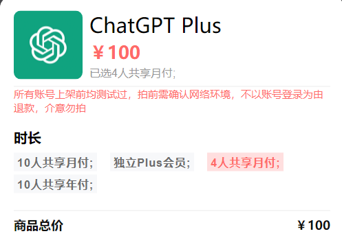

# gpt plus拼车方案

如果要使用gpt4，一个方案是升级gpt帐号到plus，然而升级gpt帐号过程非常繁琐。目前有两种方案

1. 在官网升级
2. 通过ios升级

在官网升级。首先需要申请depay或nobepay，转一些钱进去，然后再去openai绑定，升级缴费。这个过程中可能还会出现拒付的情况，如果自己操作不当，还有可能被feng号。第二个，通过ios升级，过程也有点繁琐，需要找一个国外ios帐号，充点钱进去，然后手机还要梯子，上openai付款。

除了以上两种，还有第三种，就是把这些难操作的步骤外包出去。一种就是代充，但是你不知道代充的商家人品怎样。有些代充帮你充好后，过了20多天，申请退款，然后你的主帐号可能就突然用不了plus，还有被封的风险，最后得利的是代充商家，白赚你100块，你还损失一个帐号。

之后我观望了很久，最后找到这个[平台](https://nf.video/yinhe/web?sharedId=147759)，完美解决上面的痛点。

建议拼4人车队，体验比较好，价格只需要100元/月，省钱又省去了烦人的升级步骤。我已经上车，体验不错。如果出现翻车情况，可以加客服vx处理。

如果担心自己对话隐私，可以对话完之后，再使用[42share](https://42share.io/)分享对话并保存链接，最后删除对话即可。这样其他拼车成员就看不到你的对话历史记录了。

